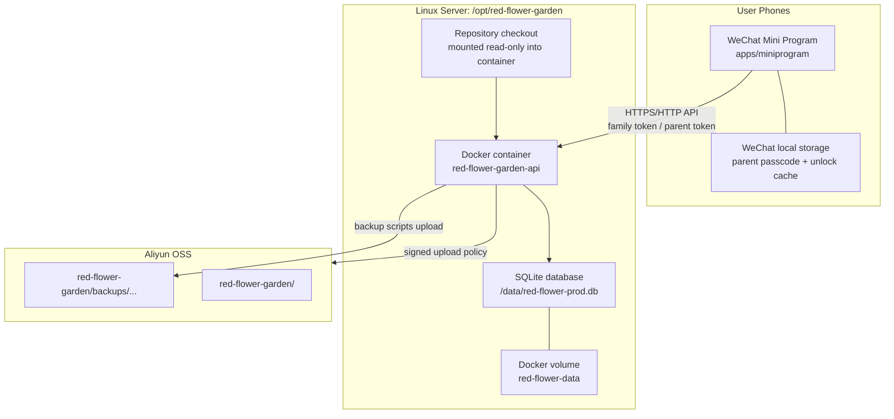
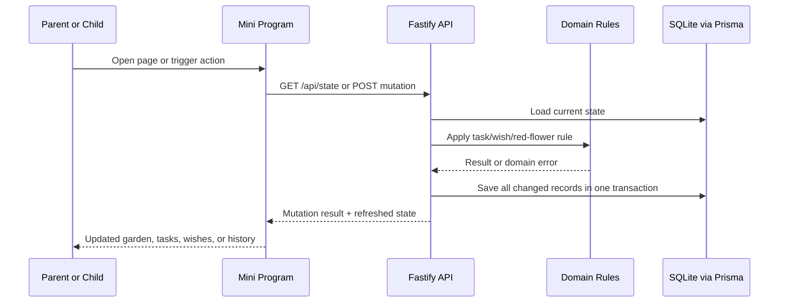
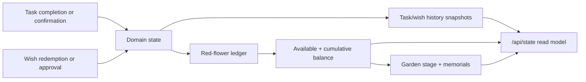

# Red Flower Garden Architecture Views

This document is the development-time architecture reference for the Red Flower Garden repository. It describes the product as a system first, then attaches responsibilities and constraints to the architecture elements that own them.

User-facing product behavior is documented in `docs/product/use-cases/red-flower-garden-use-cases.md`. Operational commands live in `deploy/README.md`.

## Architectural Goal

Red Flower Garden turns family reward rules into a small WeChat Mini Program backed by a durable server-side state model.

Three invariants define the system:

1. Child-facing interactions must be simple, immediate, and explainable.
2. Parent-controlled mutations must protect tasks, wishes, history records, and red-flower state.
3. Persistent family data must survive app refreshes, server restarts, deployments, migrations, and restore workflows.

## Logical Architecture View

This view lists the logical elements and their dependency direction. It intentionally keeps the backend application workflow and pure domain rules in one layer, because this repository is still small enough for that to be easier to read while preserving the internal boundary.

```text
+--------------------------------------------------------------------------------+
| L1 Mini Program Experience                                                      |
|                                                                                |
|  +-------------------+  +-------------------+  +-----------------------------+ |
|  | Garden page       |  | Task/Wish pages   |  | History page                | |
|  | child status      |  | family workflows  |  | calendar + correction UX    | |
|  +-------------------+  +-------------------+  +-----------------------------+ |
|                                                                                |
|  +-------------------+  +-------------------+                                  |
|  | Parent control    |  | API client        |                                  |
|  | local unlock      |  | typed HTTP calls  |                                  |
|  +-------------------+  +-------------------+                                  |
+--------------------------------------------------------------------------------+
                                      |
                                      v
+--------------------------------------------------------------------------------+
| L2 HTTP API Boundary                                                            |
|                                                                                |
|  +-------------------+  +-------------------+  +-----------------------------+ |
|  | State routes      |  | Child routes      |  | Parent routes               | |
|  | read model        |  | submit/redeem     |  | manage/approve/correct      | |
|  +-------------------+  +-------------------+  +-----------------------------+ |
|                                                                                |
|  +-------------------+  +-------------------+                                  |
|  | Prototype auth    |  | Request validation|                                  |
|  | family/parent tok |  | error mapping     |                                  |
|  +-------------------+  +-------------------+                                  |
+--------------------------------------------------------------------------------+
                                      |
                                      v
+--------------------------------------------------------------------------------+
| L3 Backend Application And Domain                                               |
|                                                                                |
|  +-------------------+  +-------------------+  +-----------------------------+ |
|  | Transactions      |  | Domain rules      |  | Object storage service      | |
|  | atomic workflows  |  | task/wish/flowers |  | wish image upload policy    | |
|  +-------------------+  +-------------------+  +-----------------------------+ |
|                                                                                |
|  +-------------------+  +-------------------+  +-----------------------------+ |
|  | State repository  |  | Garden rules      |  | Domain errors               | |
|  | load/save domain  |  | stage + memorial  |  | stable failures            | |
|  +-------------------+  +-------------------+  +-----------------------------+ |
+--------------------------------------------------------------------------------+
                                      |
                                      v
+--------------------------------------------------------------------------------+
| L4 Persistence                                                                  |
|                                                                                |
|  +-------------------+  +-------------------+  +-----------------------------+ |
|  | Prisma client     |  | SQLite schema     |  | Versioned migrations        | |
|  | data access       |  | durable state     |  | compatibility gate          | |
|  +-------------------+  +-------------------+  +-----------------------------+ |
+--------------------------------------------------------------------------------+
                                      |
                                      v
+--------------------------------------------------------------------------------+
| L5 Operations And Quality                                                       |
|                                                                                |
|  +-------------------+  +-------------------+  +-----------------------------+ |
|  | Docker deploy     |  | Backup/restore    |  | CI and E2E                  | |
|  | mounted runtime   |  | SQLite + OSS      |  | lint/type/test/devtools     | |
|  +-------------------+  +-------------------+  +-----------------------------+ |
+--------------------------------------------------------------------------------+
```

Dependencies should flow downward. UI and route code may orchestrate workflows, but durable business decisions belong in the backend application and domain layer. Inside that layer, pure domain rules in `packages/domain` must not depend on WeChat APIs, Fastify, Prisma, SQLite, local storage, object storage, or deployment scripts.

## Logical Elements

### Mini Program Experience

Owned by:

- `apps/miniprogram/app.json`
- `apps/miniprogram/pages/garden-design/*`
- `apps/miniprogram/pages/tasks/*`
- `apps/miniprogram/pages/wishes/*`
- `apps/miniprogram/pages/history/*`
- `apps/miniprogram/components/parent-control-panel/*`
- `apps/miniprogram/src/parent-control.ts`
- `apps/miniprogram/src/api/client.ts`

Responsibility:

- present child-facing garden, task, wish, and history workflows;
- keep page state synchronized with server state;
- protect parent mutations through the shared parent-control component and local unlock cache;
- translate API errors into user-understandable Mini Program feedback.

Constraints:

- Mini Program storage is not the business source of truth;
- do not introduce a second passcode store or parallel parent confirmation mechanism;
- task, wish, history, and red-flower mutations must reuse the existing parent-control flow;
- the API client should stay lightweight and Mini Program compatible.

### HTTP API Boundary

Owned by:

- `apps/api/src/app.ts`
- `apps/api/src/routes/state.ts`
- `apps/api/src/routes/child.ts`
- `apps/api/src/routes/parent.ts`
- `apps/api/src/auth/prototype-auth.ts`

Responsibility:

- expose family and parent operations over HTTP;
- enforce prototype family-token and parent-token access boundaries;
- validate request shape and map domain failures to stable API errors;
- return refreshed state after mutations so the Mini Program can re-render from server truth.

Constraints:

- child routes may submit tasks and request or redeem wishes, but must not manage rules;
- parent routes own task and wish management, approvals, and same-day history correction;
- routes should orchestrate transactions but avoid duplicating domain rules;
- `/api/state` must be a no-store read model of current persisted state.

### Backend Application And Domain

Owned by:

- `apps/api/src/repositories/state.ts`
- `apps/api/src/repositories/mappers.ts`
- `apps/api/src/repositories/database.ts`
- `apps/api/src/services/object-storage.ts`
- `packages/domain/src/tasks.ts`
- `packages/domain/src/wishes.ts`
- `packages/domain/src/red-flowers.ts`
- `packages/domain/src/garden.ts`
- `packages/domain/src/errors.ts`

Responsibility:

- load persisted records into domain-shaped state;
- save domain results back into normalized SQLite tables;
- wrap multi-step mutations in Prisma transactions;
- choose stable IDs, timestamps, and flower variants where those are application concerns;
- generate OSS upload policies for wish images;
- define task, wish, red-flower, and garden invariants;
- reject invalid inputs and impossible state transitions;
- preserve snapshots for historical explanations;
- keep cumulative flowers separate from available flowers;
- keep garden stage progression based on cumulative flowers.

Constraints:

- transactions must cover each mutation that changes business state;
- task completion and wish redemption must remain idempotent against duplicate clicks and concurrent requests;
- history correction must update snapshots, ledger entries, balances, and restoration side effects together;
- object storage credentials are server-side only and must not be printed or committed;
- domain code must be pure TypeScript with no framework, persistence, or local-storage dependency;
- red-flower spending must not reduce cumulative flowers;
- one-time tasks and one-time wishes must not be completed or redeemed twice;
- repeating tasks are limited by business day;
- wish and task history must remain meaningful even when current records are edited or archived.

### Persistence

Owned by:

- `prisma/schema.prisma`
- `apps/api/src/migrations/*`
- `scripts/check-db-migration-guard.mjs`

Responsibility:

- store tasks, task submissions, wishes, wish redemptions, red-flower balance, ledger entries, memorial decorations, and migration records;
- preserve normalized records while exposing domain-shaped state to application code;
- keep schema changes versioned and compatible with production data.

Constraints:

- schema changes require ordered versioned migrations;
- production startup must verify compatibility unless explicitly allowed to run migrations;
- destructive migrations must be marked and gated;
- live SQLite files must be backed up through online backup semantics, not direct copying.

### Operations And Quality

Owned by:

- `deploy/deploy-api.sh`
- `deploy/backup-sqlite.sh`
- `deploy/restore-sqlite.sh`
- `deploy/restore-sqlite-from-oss.sh`
- `deploy/verify-sqlite-backup.sh`
- `deploy/install-backup-timer.sh`
- `tests/e2e/*`
- `package.json` scripts

Responsibility:

- build or reuse the Docker runtime image;
- mount source code and persistent data into the production container;
- run migration preflight, backups, migrations, compatibility checks, and health checks;
- upload verified backups to OSS and restore safely when needed;
- enforce lint, typecheck, unit, API E2E, and Mini Program startup checks.

Constraints:

- ordinary backend source changes should sync the repository and restart/recreate the container without rebuilding the image;
- dependency, Dockerfile, runtime package, Prisma client generation, or package metadata changes require an image rebuild;
- production deploys that run migrations must create verified pre-migration backups when data exists;
- restore workflows must create a before-restore backup and verify service readiness.

## Physical Deployment View

The first stable version runs as a WeChat Mini Program plus one Fastify API container backed by SQLite.



### Physical Nodes

- User phones run the WeChat Mini Program. They render pages, call the API, and store only local parent-control state.
- The Linux server keeps the repository at `/opt/red-flower-garden`.
- Docker runs the API container `red-flower-garden-api` from image `red-flower-garden-api:local`.
- The container persists production SQLite data at `/data/red-flower-prod.db` through Docker volume `red-flower-data`.
- API and domain source code are mounted read-only from the server checkout for ordinary source updates.
- Server-side object storage configuration lives at `/etc/red-flower-garden/object-storage.env`.
- OSS bucket `mozhi-red-flower-garden` in region `oss-cn-guangzhou` stores backup objects under the app prefix `red-flower-garden/`.

### Physical Constraints

- Do not commit real `.env` files, AccessKeys, production DB files, or backup files.
- Do not bypass deploy scripts for production deployment, backup, migration, or restore.
- Do not directly copy the live SQLite database.
- Keep production object features under the shared app-level OSS prefix with separate child prefixes.
- The public Mini Program API endpoint is configured in `apps/miniprogram/src/config/api.ts`.

## Runtime Flow View

Runtime is intentionally simple: the Mini Program loads state, users trigger a mutation, the API runs one transaction, and the client refreshes from server state.



Parent-control verification happens in the Mini Program before protected parent operations. API token checks still guard the HTTP boundary.

## Core Data Flow



The ledger is the explanation layer for red flowers. Balance is the current total. History snapshots preserve what the family saw at the time of completion or redemption.

## Key Architecture Boundaries

### Parent Control Boundary

Parent control is a Mini Program user-experience boundary. It prevents accidental or child-initiated local management actions. It does not replace API token checks.

Protected operations include:

- creating, editing, or deleting tasks;
- creating or editing wishes;
- approving wish redemptions;
- confirming task submissions when a confirmation workflow is used;
- editing or deleting same-day history records.

### Backend Internal Boundary

The backend application and domain layer has an internal boundary: orchestration code owns transactions, persistence mapping, IDs, timestamps, and external services; domain functions own business invariants. If a rule must remain true across UI, API, tests, and future clients, it belongs in `packages/domain`.

Examples:

- one-time task completion rules;
- repeating task business-day rules;
- one-time wish redemption rules;
- available versus cumulative flower accounting;
- garden stage thresholds.

### Persistence Boundary

Persistence code maps between normalized database rows and domain-shaped aggregate state. It may manage transactions, upserts, snapshots, and ledger persistence, but it should not invent rules that bypass domain validation.

### Operations Boundary

Deploy, migration, backup, restore, and object-storage setup are operational capabilities. Product pages should reuse or reflect these semantics instead of recreating data-safety logic in the Mini Program or API routes.

## Consistency Contract

The repository has five surfaces that must stay consistent:

1. product behavior in `docs/product/use-cases/red-flower-garden-use-cases.md`;
2. Mini Program workflows in `apps/miniprogram`;
3. backend API, application orchestration, and domain rules in `apps/api` and `packages/domain`;
4. persistence schema and migrations in `prisma` and `apps/api/src/migrations`;
5. deployment and data-safety scripts in `deploy`.

When behavior changes, update the owning code and the documentation that describes the user-visible contract. When persistent state changes, update Prisma schema, versioned migrations, migration guard expectations, and deploy/restore assumptions together.

## Change Checklist

Before merging architecture-sensitive changes, verify:

- child-facing flows remain simple and explainable;
- parent mutations reuse the existing parent-control flow;
- API routes do not duplicate pure domain rules;
- `packages/domain` remains pure and framework-independent;
- red-flower ledger, balance, history snapshots, and garden state stay consistent after each mutation;
- schema changes have matching versioned migrations;
- production migration paths include backup and compatibility checks;
- backup and restore scripts still use SQLite-safe semantics;
- tests cover the changed rule at the appropriate level;
- `AGENTS.md`, product docs, architecture docs, and deploy docs point to the right source of truth.
