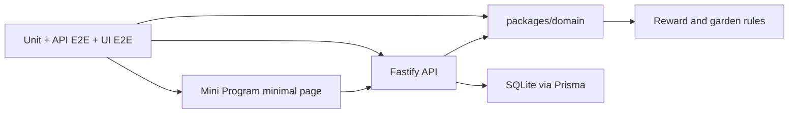

# Domain Model And Minimal E2E Plan

## Overview

This plan builds the domain model and a deliberately plain end-to-end prototype. The goal is not product polish. The goal is to prove that the core red-flower rules work through the full stack and can be exercised inside WeChat: domain model, SQLite persistence, Fastify API, a form-and-button Mini Program page, deployment/network reachability, and stable UI automation.

This is the second plan in the four-plan sequence.

---

## Problem Frame

This iteration is a technical validation slice. The project's highest-risk behavior for this slice is the reward state machine plus the ability to run it from WeChat against a reachable service. A task submission must not add official flowers. Parent confirmation must increase both available and cumulative flowers. Wish redemption must reduce available flowers without reducing cumulative flowers. Approved redemptions must create memorial decorations. These rules must be implemented in a domain layer and exercised from a real Mini Program page, even if the page is just forms and buttons.

Requirements carried from the origin document:

- R5. Child submission enters pending confirmation and must not add official red flowers.
- R10. Parents can batch-confirm pending submissions.
- R11. Parents can approve pending wish redemption requests.
- R13. Track available red flowers separately from cumulative red flowers.
- R14. Available red flowers increase only after confirmed tasks and decrease after approved wish redemption.
- R15. Cumulative red flowers increase after confirmed tasks and never decrease due to redemption.
- R17. Each approved wish redemption adds one unified memorial decoration.
- R19. Business data is not stored on the phone.

**Origin actors:** A1 Child, A2 Parent, A3 Service

**Origin flows:** F1 Child submits a task, F2 Parent confirms tasks, F3 Child requests a wish

**Origin acceptance examples:** AE1, AE2

---

## Scope Boundaries

- This plan uses a minimal UI and does not attempt child-friendly visual polish.
- This plan does not implement full task/wish management screens.
- This plan does not implement final production deployment, but it must prove the selected network path can serve the Mini Program in WeChat Developer Tools or an experience/test version.
- This plan does not implement WeChat login or family invitations.
- This plan does not finalize garden art direction.

---

## Key Technical Decisions

- Put reward transitions in `packages/domain`: The API and Mini Program must call into stable rules instead of duplicating balance logic.
- Use API E2E to test cross-request state: Unit tests prove pure rules; API E2E proves persistence and orchestration.
- Use a minimal Mini Program page as the first UI test target: Stable UI automation is easier to establish before the UI becomes visually rich.
- Keep business state on the service: The Mini Program may cache UI state transiently but must reload authoritative business data from the API.
- Define API contracts in this plan: Later child and parent UI work should not guess route names, response shapes, or error formats.
- Model WeChat request behavior explicitly: The Mini Program client must check HTTP status codes and structured business errors because `wx.request` success callbacks can still contain non-2xx responses.
- Prove network feasibility early: The service must be reachable from WeChat through a documented HTTPS/test-version path before productization proceeds.

---

## High-Level Technical Design

> This illustrates the intended approach and is directional guidance for review, not implementation specification.

---

## Implementation Units

- U1. **Model Core Domain**

**Goal:** Define the domain concepts and transitions that protect red-flower correctness.

**Requirements:** R5, R13, R14, R15, R17, AE1, AE2

**Dependencies:** Plan 001

**Files:**
- Create: `packages/domain/src/tasks.ts`
- Create: `packages/domain/src/wishes.ts`
- Create: `packages/domain/src/balances.ts`
- Create: `packages/domain/src/garden.ts`
- Create: `packages/domain/src/red-flower-rules.test.ts`
- Modify: `packages/domain/src/index.ts`

**Approach:**
- Represent task submissions, confirmation, wish requests, wish approvals, balances, and garden decorations as explicit domain concepts.
- Keep red-flower updates centralized.
- Make duplicate confirmation and insufficient-balance paths explicit error cases.

**Execution note:** Implement the domain rules test-first because they are the long-term safety net for product behavior.

**Test scenarios:**
- Happy path: Given a 2-flower task, child submission creates pending state and leaves available/cumulative balances unchanged.
- Happy path: Given that pending submission, parent confirmation increases available and cumulative balances by 2.
- Happy path: Given a 10-flower wish and 12 available flowers, approving redemption leaves 2 available flowers and unchanged cumulative flowers.
- Edge case: Confirming an already confirmed submission does not add flowers twice.
- Error path: Approving a wish redemption with insufficient available flowers fails without changing balances.
- Integration: Approved wish redemption produces exactly one unified memorial decoration event.

**Verification:**
- AE1 and AE2 core rules pass as domain unit tests.

---

- U2. **Persist Domain State**

**Goal:** Store all business data in SQLite through a clear persistence boundary.

**Requirements:** R19, R20

**Dependencies:** U1

**Files:**
- Create: `prisma/schema.prisma`
- Create: `apps/api/src/repositories/tasks.ts`
- Create: `apps/api/src/repositories/wishes.ts`
- Create: `apps/api/src/repositories/balances.ts`
- Create: `apps/api/src/repositories/garden.ts`
- Create: `apps/api/src/repositories/test-database.ts`

**Approach:**
- Model one family and one child only.
- Store fixed tasks, temporary tasks, submissions, wishes, redemption requests, balances, and memorial decorations.
- Use repository functions to isolate Prisma from route handlers and domain tests.

**Test scenarios:**
- Integration: A submitted task persists and can be loaded as pending.
- Integration: Confirming a pending task updates balances and task status in one durable operation.
- Integration: Approved wish redemption persists the balance update and decoration.
- Error path: A failed domain transition does not partially write balance or decoration changes.

**Verification:**
- Business data survives process-level reloads in test setup and does not depend on Mini Program local storage.

---

- U3. **Expose Minimal API**

**Goal:** Provide the smallest stable API surface needed for the minimal end-to-end prototype.

**Requirements:** R5, R10, R11, R13, R14, R15, R17, R19

**Dependencies:** U1, U2

**Files:**
- Create: `apps/api/src/routes/child.ts`
- Create: `apps/api/src/routes/parent.ts`
- Create: `apps/api/src/routes/state.ts`
- Create: `tests/e2e/api/red-flower-flow.test.ts`
- Modify: `apps/api/src/app.ts`

**Approach:**
- Add endpoints for loading current state, submitting a task, confirming submissions, requesting a wish, and approving a redemption.
- Keep response payloads stable enough for Mini Program UI tests and later productized screens.
- Define a minimal endpoint contract table in the plan implementation notes or API docs with method/path, request body, success body, structured error body, and authorization mode.
- Include a stable `GET /api/state` projection with `tasks`, `wishes`, `balances`, `gardenStage`, `memorialDecorations`, and pending request/submission summaries.
- Use prototype authorization from this plan onward: a family access token/session for child/state actions and a parent token/session for parent actions. Test bypasses are allowed only under `NODE_ENV=test` and must fail closed in any tunnel/experience-version mode.
- Add a test-only reset endpoint such as `POST /__test/reset`, enabled only in test mode, with named fixtures for AE1 and AE2.

**Minimal API contract:**

| Capability | Endpoint | Authorization | Response expectation |
|------------|----------|---------------|----------------------|
| Load state | `GET /api/state` | Family session/token | Aggregate task, wish, balance, garden, and pending-state projection |
| Submit task | `POST /api/child/task-submissions` | Family session/token | Updated task submission state; balances unchanged |
| Request wish | `POST /api/child/wish-redemptions` | Family session/token | Pending redemption state; balances unchanged until approval |
| Confirm tasks | `POST /api/parent/task-confirmations` | Parent session/token | Confirmed submissions and updated balances |
| Approve wish | `POST /api/parent/wish-redemptions/:id/approve` | Parent session/token | Updated balances and memorial decoration |
| Reset test data | `POST /__test/reset` | Test-only | Named fixture loaded; unavailable outside test mode |

**Test scenarios:**
- API E2E: Child submits a task, API returns pending state, balances remain unchanged.
- API E2E: Parent confirms the submission, available and cumulative balances increase.
- API E2E: Child requests a wish, parent approves it, available balance decreases and memorial decoration count increases.
- Error path: Invalid request payload returns a structured error without mutating state.
- Error path: Non-2xx responses use the same structured error envelope expected by the Mini Program client.
- Security boundary: Test-only reset and bypass routes are unavailable outside test mode.

**Verification:**
- AE1 and AE2 pass through API E2E, not only unit tests.

---

- U4. **Build Minimal Mini Program Page**

**Goal:** Create a plain but real Mini Program interface that exercises the API and domain flow.

**Requirements:** R5, R6, R19, AE1, AE2

**Dependencies:** U3

**Files:**
- Create: `apps/miniprogram/app.json`
- Create: `apps/miniprogram/app.ts`
- Create: `apps/miniprogram/app.wxss`
- Create: `apps/miniprogram/pages/prototype/index.json`
- Create: `apps/miniprogram/pages/prototype/index.wxml`
- Create: `apps/miniprogram/pages/prototype/index.wxss`
- Create: `apps/miniprogram/pages/prototype/index.ts`
- Create: `apps/miniprogram/src/api/client.ts`

**Approach:**
- The page should show current task state, balances, one wish, parent/session form inputs as needed, and buttons for child submit, parent confirm, child request, and parent approve.
- Keep visual treatment simple; this is a test vehicle, not the final child experience.
- All visible copy should be Chinese, even in the minimal prototype.
- Build a typed `wx.request` wrapper that checks `statusCode`, parses structured errors, applies timeout handling, and maps network failures to simple Chinese UI states.
- The page must be runnable in WeChat Developer Tools and, when domain/network prerequisites are satisfied, in a WeChat test/experience version.

**Test scenarios:**
- UI E2E: Open the prototype page and see initial Chinese task/balance labels.
- UI E2E: Tap `我完成啦`, then see `等家长看看` and unchanged balance.
- UI E2E: Tap parent confirmation control, then see balance increase and confirmed state.
- UI E2E: Request and approve a wish, then see available balance decrease and memorial decoration indicator increase.
- Error path: A simulated non-2xx API response shows a Chinese error state and does not mutate rendered business state.
- Network path: With the configured test/experience API base URL, the page can load state from the service inside WeChat.

**Verification:**
- The Mini Program page exercises the real service instead of mocked local state and can run in WeChat Developer Tools or a test/experience version.

---

- U5. **Stabilize Mini Program UI Test Harness**

**Goal:** Make UI automation reliable enough to remain part of the project quality loop.

**Requirements:** AE1, AE2

**Dependencies:** U4

**Files:**
- Create: `tests/e2e/miniprogram/prototype-flow.test.ts`
- Create: `tests/e2e/miniprogram/test-harness.md`
- Modify: `package.json`

**Approach:**
- Use `miniprogram-automator` for local deterministic smoke tests because the project is TypeScript/JavaScript-based and this plan needs a stable developer-machine harness.
- Document required local setup clearly because the harness depends on WeChat Developer Tools.
- Keep UI E2E focused on one deterministic happy path plus one state assertion after refresh.
- Use the test-only reset endpoint before each automated flow so tests do not depend on prior local state.

**Test scenarios:**
- Smoke: The automation harness can open the Mini Program project and navigate to the prototype page.
- Happy path: The UI test completes the submit-confirm flow against the API.
- Stability: Re-running the UI test starts from a reset test fixture and does not depend on prior local state.
- Network: UI smoke can target both a local API URL in Developer Tools and the selected test/experience API URL when WeChat domain settings allow it.

**Verification:**
- UI E2E is stable enough to run locally as a named command and can be excluded from CI only if the environment lacks WeChat Developer Tools.

---

- U6. **Prove WeChat Network Path**

**Goal:** Verify the service can be reached by the Mini Program in a realistic WeChat development or test-version environment before product UI work depends on it.

**Requirements:** R20, R21, R22, R23

**Dependencies:** U3, U4

**Files:**
- Create: `docs/deployment/network-feasibility.md`
- Create: `docs/deployment/wechat-request-domain-spike.md`
- Modify: `apps/miniprogram/src/api/client.ts`
- Modify: `README.md`

**Approach:**
- Treat Cloudflare Tunnel, Tencent Cloud/WeChat Cloud Run, and any other HTTPS hosting path as candidates until one passes WeChat request-domain feasibility.
- Record the exact test environment: Developer Tools with domain validation on/off, WeChat test/experience version if available, API base URL, certificate/TLS status, and whether the domain can be configured in the Mini Program backend.
- Do not claim R22 complete until the Mini Program can call the service outside the home network through the selected path.

**Test scenarios:**
- Operational: Mini Program loads `GET /api/state` from the selected HTTPS endpoint.
- Operational: Developer Tools test is repeated with request domain validation enabled when possible.
- Operational: A non-home network or mobile-network device can reach the service through the selected endpoint.
- Fallback: If the preferred endpoint cannot satisfy WeChat request-domain constraints, the document records the failing reason and the next candidate path.

**Verification:**
- There is a documented, repeatable network path for running the form-and-button prototype from WeChat against the service.

---

## System-Wide Impact

- **Interaction graph:** Mini Program calls Fastify routes; routes orchestrate repositories and domain transitions; repositories persist through Prisma/SQLite.
- **Error propagation:** Domain errors should become structured API errors and clear UI states without partial persistence.
- **State lifecycle risks:** Duplicate confirmation, insufficient flower balance, and failed redemption are the main state risks.
- **API surface parity:** Child and parent actions both depend on the same balance and garden rules.
- **Integration coverage:** Unit tests cover rules, API E2E covers persistence and orchestration, UI E2E proves Mini Program integration.
- **Unchanged invariants:** No business data should be stored as authoritative state on the phone.

---

## Risks & Dependencies

| Risk | Mitigation |
|------|------------|
| Domain model becomes too abstract before product feedback | Model only flows required by AE1 and AE2 in this plan |
| UI automation is brittle in local developer environments | Start with one deterministic prototype page and document setup in `tests/e2e/miniprogram/test-harness.md` |
| API route handlers absorb business logic | Require unit coverage in `packages/domain` before API E2E is considered complete |
| The Mini Program works locally but cannot call the service in WeChat | Add U6 network feasibility before child experience productization |
| Test bypasses leak into a public tunnel | Restrict bypass/reset endpoints to `NODE_ENV=test` and fail closed in tunnel or experience-version mode |

---

## Documentation / Operational Notes

- Update `docs/e2e/red-flower-garden-acceptance.md` with the exact manual steps matching the minimal page.
- Document how to reset test data before API E2E and UI E2E.
- `docs/deployment/network-feasibility.md` should record the selected network path and evidence that the Mini Program can call the API from WeChat.

---

## Sources & References

- Origin document: `docs/brainstorms/red-flower-garden-prototype-requirements.md`
- Previous plan: `docs/plans/2026-04-25-001-engineering-foundation-plan.md`
- Follow-up plan: `docs/plans/2026-04-25-003-child-garden-productization-plan.md`
