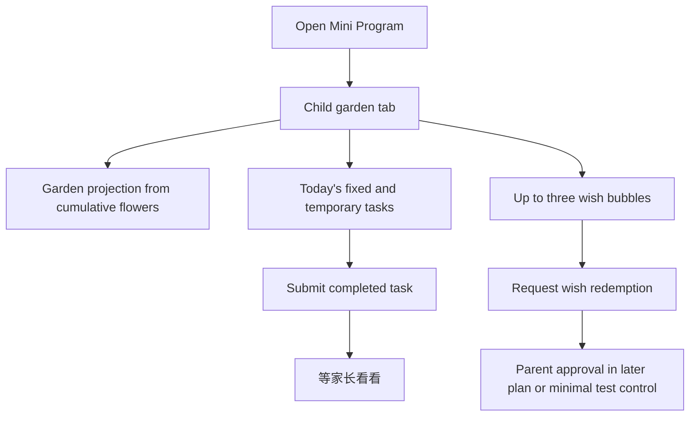

# Child Garden Experience Productization Plan

## Overview

This plan turns the minimal end-to-end prototype into the first real child-facing product experience. The child should land in a playful garden, understand today's tasks, see wish bubbles, submit completed work, and understand that parent confirmation is pending.

This is the third plan in the four-plan sequence.

---

## Problem Frame

The child side must not feel like a task manager. The origin requirements emphasize emotional feedback, garden growth, wish bubbles, and child-friendly Chinese copy. This plan keeps the domain/API foundation from plan 002, then builds the child-facing Mini Program experience on top of it.

Requirements carried from the origin document:

- R1. Default to a child-friendly garden tab with the garden above the task list.
- R2. Use child-friendly copy: `我完成啦`, `等家长看看`, and `开花啦`.
- R3. Show today's tasks below the garden, including fixed daily tasks and today's temporary tasks.
- R4. Show up to three active wish bubbles with progress.
- R5. Child submission enters pending confirmation without immediately adding official flowers.
- R6. All user-facing Mini Program copy must be Chinese.
- R7. The child garden must have high visual appeal for a 5-year-old and use illustration-like visual assets.
- R16. The garden grows from cumulative red flowers, not available balance.
- R17. Approved wish redemption adds one unified memorial decoration.

**Origin actors:** A1 Child, A3 Service

**Origin flows:** F1 Child submits a task, F3 Child requests a wish

**Origin acceptance examples:** AE1, AE2, AE3

---

## Scope Boundaries

- This plan does not build the full parent management system; it may use the minimal parent controls from plan 002 for testing.
- This plan does not add child-selected decorations.
- This plan does not add calendars, reports, proof uploads, bonus flowers, or punishment deductions.
- This plan does not require public production release.

---

## Key Technical Decisions

- Keep child UI state service-derived: The Mini Program should render current state from API responses and avoid authoritative local business storage.
- Treat garden growth as a projection of cumulative flowers: Available balance can go down after redemption, but the garden must not shrink.
- Use assets intentionally: The first garden visual system should be structured enough to replace or improve assets later without rewriting business logic.
- Keep parent testing controls separate from child UI: Any temporary controls needed for E2E should not leak into the final child garden tab.
- Make visual and copy decisions testable: Child-facing Chinese strings, garden stages, asset inventory, component states, and screenshot checks should be documented before implementation finishes.

---

## High-Level Technical Design

> This illustrates the intended approach and is directional guidance for review, not implementation specification.

---

## Implementation Units

- U0. **Define Child Experience Spec**

**Goal:** Turn child-facing visual direction, copy, and interaction states into implementation-ready acceptance criteria.

**Requirements:** R1, R2, R4, R6, R7, R16, R17, AE2, AE3

**Dependencies:** Plan 002

**Files:**
- Create: `docs/design/child-experience-spec.md`
- Create: `docs/design/copy.md`
- Create: `docs/design/component-state-matrix.md`

**Approach:**
- Define the garden composition, first-viewport priority, growth stages, wish bubble behavior, and memorial decoration meaning.
- Define exact Chinese copy for child states, task actions, wish states, loading, retry, empty, success, and error states.
- Define child component states for garden, task list, and wishes: loading, empty, network error, stale refresh, submit success, pending confirmation, confirmed, wish locked, wish request pending, and wish approved.
- Define responsive/accessibility gates: iPhone SE-class width, common large-screen phone width, minimum 44px touch targets, no overlapping Chinese text, readable labels, and accessible names for interactive controls.

**Test scenarios:**
- Documentation: Every child-facing state has approved Chinese copy and expected UI behavior.
- Documentation: Garden stages and memorial decoration have clear pass/fail visual criteria.
- Visual review: Target screenshots can be checked against the spec before the implementation is accepted.

**Verification:**
- Productized child UI implementation has a design/copy source of truth instead of relying on adjectives like "cute" or "child-friendly."

---

- U1. **Create Child Garden Tab Shell**

**Goal:** Make the Mini Program default to the child garden experience.

**Requirements:** R1, R6, AE3

**Dependencies:** U0

**Files:**
- Create: `apps/miniprogram/pages/garden/index.json`
- Create: `apps/miniprogram/pages/garden/index.wxml`
- Create: `apps/miniprogram/pages/garden/index.wxss`
- Create: `apps/miniprogram/pages/garden/index.ts`
- Modify: `apps/miniprogram/app.json`

**Approach:**
- Set the garden page as the default entry.
- Layout garden content above the task list.
- Keep copy Chinese and child-friendly.

**Test scenarios:**
- Happy path: Opening the Mini Program shows the garden page first.
- Integration: The garden region appears before today's task list in the page structure.
- Error path: If API state fails to load, the child sees a simple Chinese retry/empty state, not raw technical text.

**Verification:**
- AE3 passes in manual and UI smoke testing.

---

- U2. **Render Garden Growth And Memorial Decorations**

**Goal:** Show visual progress driven by cumulative red flowers and approved redemptions.

**Requirements:** R7, R16, R17, AE2

**Dependencies:** U0, U1

**Files:**
- Create: `apps/miniprogram/components/garden-scene/index.json`
- Create: `apps/miniprogram/components/garden-scene/index.wxml`
- Create: `apps/miniprogram/components/garden-scene/index.wxss`
- Create: `apps/miniprogram/components/garden-scene/index.ts`
- Create: `apps/miniprogram/assets/garden/README.md`
- Create: `apps/miniprogram/assets/garden/stage-0.png`
- Create: `apps/miniprogram/assets/garden/stage-1.png`
- Create: `apps/miniprogram/assets/garden/stage-2.png`
- Create: `apps/miniprogram/assets/garden/memorial-decoration.png`
- Modify: `packages/domain/src/garden.ts`
- Modify: `packages/domain/src/red-flower-rules.test.ts`

**Approach:**
- Define the first small set of cumulative-flower thresholds for visual growth.
- Render a unified memorial decoration after approved redemptions, using the visual form defined in `docs/design/child-experience-spec.md`.
- Choose and document the rendering approach: WXML image layering for the first version unless implementation proves canvas is necessary.
- Record asset dimensions, format, source/licensing, and replacement guidance in `apps/miniprogram/assets/garden/README.md`.
- Keep threshold calculation in domain/API, while the Mini Program handles presentation.

**Test scenarios:**
- Unit: Cumulative flower thresholds produce expected garden stages.
- Unit: Available balance changes do not reduce garden stage.
- UI: A state with one approved redemption shows one memorial decoration.
- Visual smoke: Garden scene renders the expected stage asset and memorial decoration at iPhone SE-class and common large-screen phone widths.
- Visual review: The garden appears illustration-like, is the dominant first-viewport signal, and does not collapse into generic task UI.

**Verification:**
- Garden growth is visibly tied to cumulative flowers and does not regress after wish redemption.

---

- U3. **Build Today's Task List**

**Goal:** Show fixed daily tasks and today's temporary tasks below the garden.

**Requirements:** R2, R3, R5, R6, AE1, AE3

**Dependencies:** U0, U1

**Files:**
- Create: `apps/miniprogram/components/task-list/index.json`
- Create: `apps/miniprogram/components/task-list/index.wxml`
- Create: `apps/miniprogram/components/task-list/index.wxss`
- Create: `apps/miniprogram/components/task-list/index.ts`
- Modify: `apps/miniprogram/src/api/client.ts`
- Modify: `apps/api/src/routes/state.ts`

**Approach:**
- Load today's fixed and temporary tasks from the service.
- Render task state with the required child-friendly Chinese copy.
- Disable repeated submit action while a task is pending or confirmed.

**Test scenarios:**
- Happy path: A fixed daily task and temporary task both appear in today's list.
- Happy path: Tapping `我完成啦` changes the task to `等家长看看`.
- Edge case: A pending task cannot be submitted again.
- Integration: Confirmed task state renders as `开花啦` after service state updates.

**Verification:**
- The child can understand and submit today's tasks without seeing management UI.

---

- U4. **Build Wish Bubble Progress**

**Goal:** Show up to three active wishes with visible progress toward redemption.

**Requirements:** R4, R6, R14, AE2

**Dependencies:** U0, U1, U2

**Files:**
- Create: `apps/miniprogram/components/wish-bubbles/index.json`
- Create: `apps/miniprogram/components/wish-bubbles/index.wxml`
- Create: `apps/miniprogram/components/wish-bubbles/index.wxss`
- Create: `apps/miniprogram/components/wish-bubbles/index.ts`
- Modify: `apps/miniprogram/pages/garden/index.ts`
- Modify: `apps/api/src/routes/state.ts`

**Approach:**
- Render at most three active wishes returned by the service.
- Display progress based on available flowers and wish cost.
- Allow request action only when available flowers meet the wish cost.

**Test scenarios:**
- Happy path: Three active wishes render; a fourth active wish is not shown on the child page.
- Happy path: A wish with enough available flowers can be requested.
- Edge case: A wish without enough flowers shows progress but cannot be requested.
- Integration: After redemption approval, available balance decreases while garden stage remains based on cumulative flowers.

**Verification:**
- The child sees clear goal progress without confusing available and cumulative flower concepts.

---

- U5. **Expand Child-Facing E2E Coverage**

**Goal:** Make the productized child experience testable through both human-readable and automated paths.

**Requirements:** AE1, AE2, AE3

**Dependencies:** U0, U1, U2, U3, U4

**Files:**
- Modify: `docs/e2e/red-flower-garden-acceptance.md`
- Create: `tests/e2e/miniprogram/child-garden-flow.test.ts`

**Approach:**
- Add a human-readable child scenario covering open app, view garden, submit task, wait for parent, and observe confirmed state.
- Add UI E2E for the same critical path with reset fixtures.

**Test scenarios:**
- Manual E2E: Child opens the app and first sees the garden above tasks.
- UI E2E: Task submit path renders `等家长看看`.
- UI E2E: Confirmed state renders `开花啦`.
- UI E2E: Wish bubble progress updates after balance changes.
- UX validation: After at most one adult demonstration, the child can identify the task action, pending state, flower progress, and wish bubble progress without adult translation.
- Responsive: Child garden, task list, and wish bubbles do not overlap or truncate critical Chinese text at target phone widths.

**Verification:**
- Child experience behavior can be regression-tested without reading implementation code.

---

## System-Wide Impact

- **Interaction graph:** Garden page loads aggregate state, then child actions call child routes and refresh state.
- **Error propagation:** Child-facing errors must use gentle Chinese copy and avoid technical details.
- **State lifecycle risks:** UI refresh after submit/confirm must not drift from service state.
- **API surface parity:** State route must provide enough data for garden, tasks, wishes, balances, and decorations.
- **Integration coverage:** UI E2E should cover the child path; domain/API tests continue to cover underlying rules.
- **Unchanged invariants:** Child UI does not become a management interface and does not own business state.

---

## Risks & Dependencies

| Risk | Mitigation |
|------|------------|
| Visual polish delays functional learning | Implement simple but deliberate assets first, then refine in plan 004 |
| Garden growth logic leaks into UI | Keep threshold logic in domain/API and pass render-ready state to the Mini Program |
| Child page becomes cluttered | Keep parent controls out of the child garden tab |
| "Child-friendly" stays too vague to implement | Require `docs/design/child-experience-spec.md`, `docs/design/copy.md`, and screenshot-based checks |
| UI works on one simulator but breaks on small phones | Add width-specific screenshot and no-overlap acceptance for child surfaces |

---

## Documentation / Operational Notes

- Asset notes in `apps/miniprogram/assets/garden/README.md` should explain which images correspond to garden stages and memorial decoration.
- `docs/design/copy.md` is the source of truth for user-facing Chinese strings and should be referenced by UI tests for key labels.
- `docs/design/component-state-matrix.md` should be updated when new child-facing states are introduced.
- E2E docs should use Chinese scenario text for the child-facing steps.

---

## Sources & References

- Origin document: `docs/brainstorms/red-flower-garden-prototype-requirements.md`
- Previous plan: `docs/plans/2026-04-25-002-domain-minimal-e2e-plan.md`
- Follow-up plan: `docs/plans/2026-04-25-004-parent-deployment-acceptance-plan.md`
