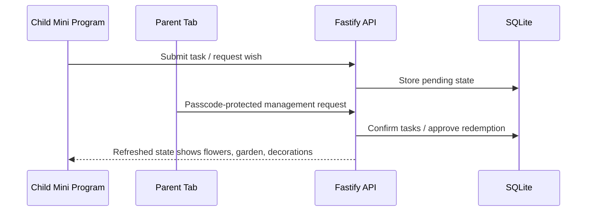

# Parent Management, Deployment, And Acceptance Plan

## Overview

This plan completes the realistic family-use prototype. It adds the parent management surface, passcode protection, task and wish configuration, public HTTPS access for experience-version testing, and the complete acceptance suite.

This is the fourth plan in the four-plan sequence.

---

## Problem Frame

The child experience only works in daily life if parent confirmation and configuration are lightweight. The service also must be reachable from real devices outside the home network. This plan completes the management side and verifies the product in a realistic WeChat Mini Program experience environment.

Requirements carried from the origin document:

- R8. Parent tab management content requires a fixed 4-digit parent passcode.
- R9. Parent tab uses efficient management UI, not child-themed layout.
- R10. Parents can batch-confirm pending task submissions.
- R11. Parents can approve pending wish redemption requests.
- R12. Parents can manage fixed daily tasks, add today's temporary tasks, and manage up to three active wish bubbles.
- R18. The prototype must not enforce a daily earning cap.
- R20. Service runs on Windows or macOS.
- R21. Prototype is for WeChat Mini Program development or experience-version use.
- R22. Service must be reachable from outside the home network.
- R23. Use lightweight shared access and defer full accounts, invitations, and WeChat login.

**Origin actors:** A1 Child, A2 Parent, A3 Service

**Origin flows:** F2 Parent confirms tasks, F3 Child requests a wish

**Origin acceptance examples:** AE1, AE2, AE4

---

## Scope Boundaries

- No full public-user account system.
- No WeChat login.
- No family invitation or multi-parent role management.
- No calendar, reports, proof uploads, bonus flowers, punishment deductions, undo confirmation, or complex audit log.
- No child-selected decorations.
- No public release hardening beyond experience-version needs.

---

## Key Technical Decisions

- Use a fixed 4-digit passcode for prototype parent access: This matches the lightweight access requirement and avoids premature account work.
- Keep parent UI tool-like: Parent workflows should prioritize fast scanning and batch action over playful child copy.
- Treat Cloudflare Tunnel as a candidate, not a guaranteed default: WeChat request-domain constraints must be proven with the exact hostname, HTTPS/TLS posture, backend configuration, and validation enabled before the plan commits to it.
- Use a server-issued parent session behind the 4-digit passcode: The passcode is a prototype verification gesture, while the API boundary must enforce short-lived tokens, rate limiting, and fail-closed authorization.
- Keep complete acceptance human-readable: The family should be able to validate the daily loop without reading code.

---

## High-Level Technical Design

> This illustrates the intended approach and is directional guidance for review, not implementation specification.

---

## Implementation Units

- U0. **Run Domain And Deployment Preflight**

**Goal:** Confirm deployment prerequisites and public API constraints before final experience-version acceptance depends on them.

**Requirements:** R20, R21, R22, R23

**Dependencies:** Plan 003

**Files:**
- Create: `docs/deployment/preflight-checklist.md`
- Modify: `docs/deployment/network-feasibility.md`
- Modify: `docs/deployment/wechat-domain-checklist.md`

**Approach:**
- Verify required accounts and access: Mini Program AppID/admin access, request-domain backend access, owned or usable domain, HTTPS certificate/TLS status, ICP/domain feasibility where required, and selected host/tunnel credentials.
- Compare deployment candidates: Cloudflare Tunnel, Tencent Cloud/WeChat Cloud Run, or another HTTPS hosting path that can satisfy WeChat test/experience-version constraints.
- Promote a candidate only after the Mini Program can call `GET /api/state` with domain validation enabled where possible.
- Keep local development independent of the public endpoint.

**Test scenarios:**
- Operational: The selected endpoint is reachable from a non-home network.
- Operational: The exact request domain can be configured or accepted for the Mini Program test/experience flow.
- Operational: DevTools request-domain validation is enabled for the final preflight check unless the document explicitly records why that is impossible.

**Verification:**
- The plan has a concrete deployment path with pass/fail evidence before parent/family acceptance is claimed.

---

- U1. **Add Parent Passcode Boundary**

**Goal:** Protect management content behind a fixed 4-digit passcode.

**Requirements:** R8, R23, AE4

**Dependencies:** U0

**Files:**
- Create: `apps/api/src/auth/parent-passcode.ts`
- Create: `apps/miniprogram/pages/parent/index.json`
- Create: `apps/miniprogram/pages/parent/index.wxml`
- Create: `apps/miniprogram/pages/parent/index.wxss`
- Create: `apps/miniprogram/pages/parent/index.ts`
- Modify: `apps/miniprogram/app.json`

**Approach:**
- Require passcode entry before rendering parent controls.
- Exchange the 4-digit passcode with the server through a route such as `POST /api/parent/session`.
- Store only an opaque short-lived parent session token on the Mini Program side; never store the passcode itself and never treat a UI marker as authorization.
- Enforce token expiry server-side. Prefer memory-only client storage when usable; otherwise include expiry and clear the token on logout or inactivity.
- Store the passcode hash, token signing secret, family access secret, database path, and tunnel credentials in environment/OS secret storage. Commit only examples.
- Add server-side rate limiting, backoff or lockout, generic failure messages, and default-deny behavior for all parent routes.

**Test scenarios:**
- Happy path: Correct 4-digit passcode reveals parent management content.
- Error path: Incorrect passcode keeps management content hidden and shows Chinese feedback.
- Security boundary: Management API rejects requests without valid prototype parent authorization.
- Security boundary: Repeated incorrect passcodes are throttled or locked out.
- Security boundary: Expired parent token cannot call parent APIs.
- AE4: Tapping parent tab does not show management controls before passcode entry.

**Verification:**
- AE4 passes through manual and automated UI checks.

---

- U2. **Build Parent Confirmation Workflow**

**Goal:** Let parents review and batch-confirm pending task submissions quickly.

**Requirements:** R9, R10, R13, R14, R15, AE1

**Dependencies:** U0, U1

**Files:**
- Create: `apps/miniprogram/components/pending-submission-list/index.json`
- Create: `apps/miniprogram/components/pending-submission-list/index.wxml`
- Create: `apps/miniprogram/components/pending-submission-list/index.wxss`
- Create: `apps/miniprogram/components/pending-submission-list/index.ts`
- Modify: `apps/api/src/routes/parent.ts`
- Create: `tests/e2e/api/parent-confirmation-flow.test.ts`
- Create: `tests/e2e/miniprogram/parent-confirmation-flow.test.ts`

**Approach:**
- Show pending submissions in a compact management list.
- Support selecting one or more pending submissions and confirming them in a single action.
- Ensure confirmation is idempotent or safely rejects already confirmed items without double rewards.
- Define parent management information architecture: pending count first, pending submissions next, task/wish management below, empty states for each section, select all behavior, and concise parent-facing Chinese action labels.

**Test scenarios:**
- Happy path: Parent batch-confirms two pending submissions and balances increase by the combined value.
- Edge case: Confirming a submission twice does not add flowers twice.
- Integration: Child garden shows `开花啦` after confirmation and refresh.
- Error path: Partial failure in batch confirmation does not leave inconsistent balances.
- Product acceptance: Parent can review and confirm a normal day's pending submissions within 30-60 seconds and without developer help.

**Verification:**
- AE1 passes through domain, API E2E, Mini Program UI E2E, and manual E2E.

---

- U3. **Build Parent Task And Wish Management**

**Goal:** Allow parents to configure the daily inputs that drive the child experience.

**Requirements:** R3, R4, R9, R12, R18

**Dependencies:** U0, U1

**Files:**
- Create: `apps/miniprogram/components/task-management/index.json`
- Create: `apps/miniprogram/components/task-management/index.wxml`
- Create: `apps/miniprogram/components/task-management/index.wxss`
- Create: `apps/miniprogram/components/task-management/index.ts`
- Create: `apps/miniprogram/components/wish-management/index.json`
- Create: `apps/miniprogram/components/wish-management/index.wxml`
- Create: `apps/miniprogram/components/wish-management/index.wxss`
- Create: `apps/miniprogram/components/wish-management/index.ts`
- Modify: `apps/api/src/routes/parent.ts`
- Modify: `packages/domain/src/tasks.ts`
- Modify: `packages/domain/src/wishes.ts`

**Approach:**
- Support fixed daily tasks and today's temporary tasks.
- Support creating/updating/deactivating wishes while enforcing at most three active wishes.
- Do not implement a daily flower cap.
- Use the Chinese parent copy defined in `docs/design/copy.md` for labels, empty states, validation, save, deactivate, and failure messages.

**Test scenarios:**
- Happy path: Parent creates a fixed daily task and it appears in the child garden today.
- Happy path: Parent adds a temporary task and it appears only for today.
- Edge case: Creating a fourth active wish is rejected or requires deactivating another wish.
- Regression: No daily flower earning cap blocks multiple confirmed tasks.
- Product acceptance: Parent can add tomorrow's task or update a wish without database access or developer assistance.

**Verification:**
- Parent can maintain the content needed for daily real-family use without database edits.

---

- U4. **Build Wish Approval Workflow**

**Goal:** Complete the wish redemption loop from child request to parent approval.

**Requirements:** R11, R14, R15, R17, AE2

**Dependencies:** U0, U1, U3

**Files:**
- Create: `apps/miniprogram/components/redemption-request-list/index.json`
- Create: `apps/miniprogram/components/redemption-request-list/index.wxml`
- Create: `apps/miniprogram/components/redemption-request-list/index.wxss`
- Create: `apps/miniprogram/components/redemption-request-list/index.ts`
- Modify: `apps/api/src/routes/parent.ts`
- Create: `tests/e2e/api/wish-redemption-flow.test.ts`
- Create: `tests/e2e/miniprogram/wish-redemption-flow.test.ts`

**Approach:**
- Show pending redemption requests in parent management.
- Approve requests through the domain redemption rule.
- Refresh child state so the garden shows the memorial decoration and updated available balance.

**Test scenarios:**
- Happy path: Parent approves a pending redemption; available flowers decrease, cumulative flowers do not decrease, and one decoration appears.
- Error path: Approval fails if available flowers are no longer sufficient.
- Edge case: Approving the same redemption twice does not create duplicate decorations.
- Integration: Child garden reflects updated wish/decor state after approval.

**Verification:**
- AE2 passes through domain, API E2E, Mini Program UI E2E, and manual E2E.

---

- U5. **Deploy Experience-Version Service**

**Goal:** Make the service reachable from real devices through a stable HTTPS endpoint.

**Requirements:** R20, R21, R22, R23

**Dependencies:** U0, U1, U2, U3, U4

**Files:**
- Create: `docs/deployment/experience-service.md`
- Create: `docs/deployment/wechat-domain-checklist.md`
- Create: `apps/api/.env.example`
- Modify: `README.md`

**Approach:**
- Document Windows local development and Mac mini hosting paths.
- Use the candidate selected by U0. Cloudflare Tunnel may be used only if the exact endpoint satisfies WeChat request-domain and real-device/test-version constraints.
- Document WeChat request legal domain configuration, TLS/certificate status, ICP/domain feasibility where required, and experience-version verification steps.
- Expose only intended API paths, bind the local origin safely behind the tunnel/host, and disable test/reset/debug routes in tunnel or experience-version mode.
- Document rate limiting/WAF options where available, tunnel token storage/rotation, and that WeChat domain validation is not authentication.
- Keep secrets and passcodes outside committed files.

**Test scenarios:**
- Operational: API is reachable through the configured HTTPS domain from a non-home network.
- Operational: Mini Program requests succeed with WeChat domain validation enabled.
- Regression: Local development can still run without the public tunnel.
- Security: Test-only reset/bypass routes are unavailable through the public endpoint.

**Verification:**
- A real phone or WeChat Developer Tools experience-version flow can call the deployed API.

---

- U6. **Complete Acceptance And Regression Suite**

**Goal:** Ensure the whole prototype can be verified repeatedly by both humans and automation.

**Requirements:** AE1, AE2, AE3, AE4

**Dependencies:** U0, U1, U2, U3, U4, U5

**Files:**
- Modify: `docs/e2e/red-flower-garden-acceptance.md`
- Create: `docs/e2e/experience-version-checklist.md`
- Modify: `tests/e2e/api/README.md`
- Modify: `tests/e2e/miniprogram/README.md`

**Approach:**
- Expand human-readable acceptance to cover the complete loop: child submit, parent confirm, garden growth, wish request, parent approval, memorial decoration.
- Make automated coverage explicit: domain unit tests, API E2E, Mini Program smoke/E2E, and manual experience-version checks.
- Record known environment prerequisites for UI automation and WeChat testing.
- Add product acceptance gates from the origin success criteria: child understands the loop after at most one adult demonstration, child uses or agrees to use it across three daily sessions, parent batch confirmation stays under the agreed time threshold, and parent can maintain tasks/wishes without developer help.
- Split confidence layers: `miniprogram-automator` local smoke remains useful, while real-device/test-version manual acceptance or Minium/cloud-test style validation provides higher confidence.

**Test scenarios:**
- Manual E2E: Complete family-use loop succeeds on a real or experience-version Mini Program environment.
- API regression: AE1 and AE2 remain covered by API E2E.
- UI regression: AE3 and AE4 remain covered by Mini Program UI E2E or smoke tests.
- Quality gate: `lint`, `typecheck`, unit tests, API E2E, and configured UI tests pass before the prototype is considered ready.
- Product: Child can identify the garden, task state, wish progress, and memorial decoration without adult translation after initial demonstration.
- Product: Parent can complete confirmation and simple management flows fast enough that the confirmation step does not feel like a chore.

**Verification:**
- The prototype can be revalidated without relying on the original implementer remembering hidden setup steps.

---

## System-Wide Impact

- **Interaction graph:** Child and parent tabs now both depend on service state and must stay consistent after management actions.
- **Error propagation:** Parent management errors should be concise, actionable, and Chinese; API errors should remain structured for tests.
- **State lifecycle risks:** Batch confirmation, redemption approval, duplicate actions, and network failures are the main consistency risks.
- **API surface parity:** Parent actions and child state refresh must produce compatible projections.
- **Integration coverage:** Complete coverage requires domain unit tests, API E2E, Mini Program UI tests, and manual experience-version checks.
- **Unchanged invariants:** No full account system, no WeChat login, no multi-family support, and no authoritative business data on the phone.

---

## Risks & Dependencies

| Risk | Mitigation |
|------|------------|
| Fixed passcode is too weak for public release | Keep this explicitly scoped to experience version and document account systems as deferred |
| Fixed passcode is brute-forceable over public HTTPS | Use server-side throttling, lockout/backoff, short-lived parent tokens, and default-deny parent APIs |
| Cloudflare Tunnel may not satisfy WeChat request-domain constraints | Treat it as a candidate and require U0 domain feasibility proof, with fallback hosting paths documented |
| Cloudflare Tunnel setup differs between Windows and Mac mini | Document both paths and keep local development independent of tunnel availability |
| WeChat legal domain configuration blocks real-device testing | Create a dedicated preflight checklist before final acceptance |
| Test bypass endpoints leak into deployment | Disable test/reset/debug routes outside test mode and verify they are unavailable through the public endpoint |
| Parent management becomes too playful or slow | Use compact lists, batch actions, and management-oriented Chinese copy |

---

## Documentation / Operational Notes

- Deployment docs must distinguish local development, tunnel testing, and experience-version validation.
- Deployment docs must distinguish platform/domain validation from application authorization.
- Secret handling docs must cover parent passcode hash, family access secret, token signing secret, database path, Cloudflare/tunnel credentials, `.env.example`, `.gitignore`, log redaction, and rotation.
- SQLite deployment notes should place the database outside the repo by default, avoid committing local DB files, restrict file permissions, and document prototype backup/deletion expectations.
- The final acceptance checklist should be usable by a non-implementing parent/developer.

---

## Sources & References

- Origin document: `docs/brainstorms/red-flower-garden-prototype-requirements.md`
- Previous plan: `docs/plans/2026-04-25-003-child-garden-productization-plan.md`
